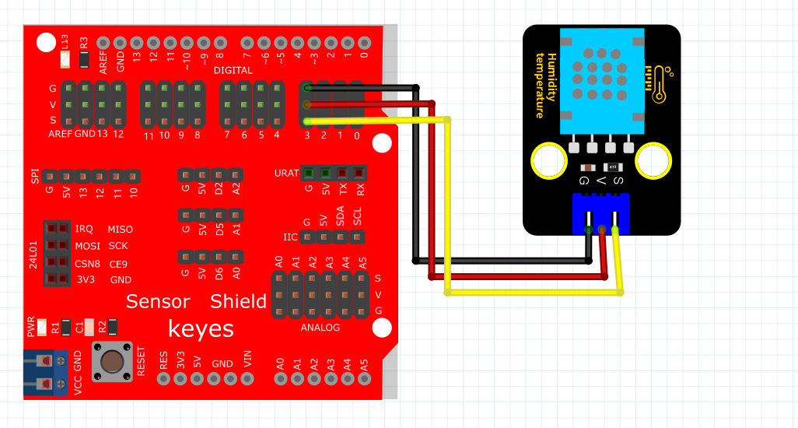
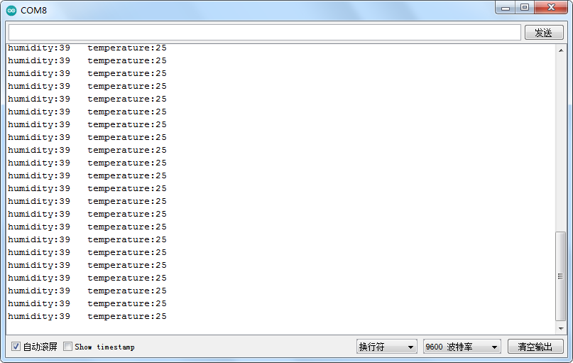

# Arduino


## 1. Arduino简介  

Arduino是一款开源电子原型平台，特别适合电子爱好者和初学者。Arduino硬件一般包括多个微控制器开发板（例如Arduino UNO、MEGA等）以及Arduino IDE软件，用于编写和上传代码。Arduino社区活跃，拥有丰富的学习资源和共享项目，使用简单的C/C++语言进行编程。通过与各种传感器、执行器和模块进行连接，用户能够快速构建自己的电子项目，涵盖从简单的LED闪烁到复杂的机器人和智能家居系统等多种应用。Arduino平台的灵活性和易用性，使得它成为教育和DIY项目的理想选择。  

## 2. 连接图  

  

## 3. 测试代码  

```cpp  
#include <dht11.h>  

dht11 DHT;  
#define DHT11_PIN 3  

void setup() {  
    Serial.begin(9600);  
    Serial.println("DHT TEST PROGRAM ");  
    Serial.print("LIBRARY VERSION: ");  
    Serial.println(DHT11LIB_VERSION);  
    Serial.println();  
    Serial.println("Type,\tstatus,\tHumidity (%),\tTemperature (C)");  
}  

void loop() {  
    int chk;  
    Serial.print("DHT11, \t");  
    chk = DHT.read(DHT11_PIN); // READ DATA  
    switch (chk) {  
        case DHTLIB_OK:  
            Serial.print("OK,\t");  
            break;  
        case DHTLIB_ERROR_CHECKSUM:  
            Serial.print("Checksum error,\t");  
            break;  
        case DHTLIB_ERROR_TIMEOUT:  
            Serial.print("Time out error,\t");  
            break;  
        default:  
            Serial.print("Unknown error,\t");  
            break;  
    }  
    // DISPLAY DATA  
    Serial.print(DHT.humidity, 1);  
    Serial.print(",\t");  
    Serial.println(DHT.temperature, 1);  
    delay(1000);  
}  
```  

## 4. 测试结果  

按照上图接好线，烧录好代码，上电后，您可以在软件串口监视器中看到当前环境温度值和湿度值，如下图所示。  

  

## 5. 相关库文件链接地址  

[相关库文件](https://pan.baidu.com/s/1WGbYih4yH--6moqK9HsKRg)  
提取码：9afu


