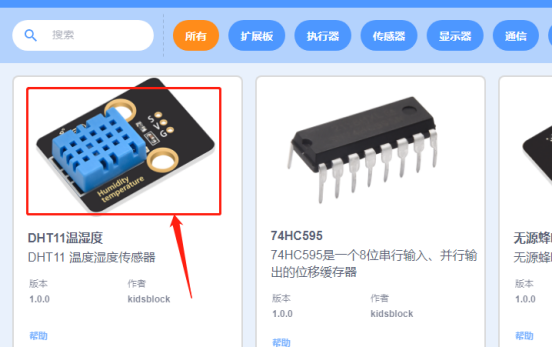
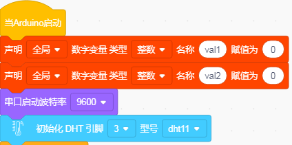
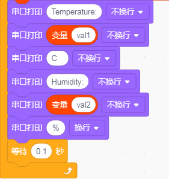
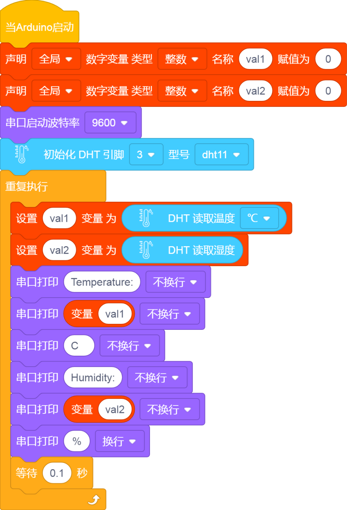
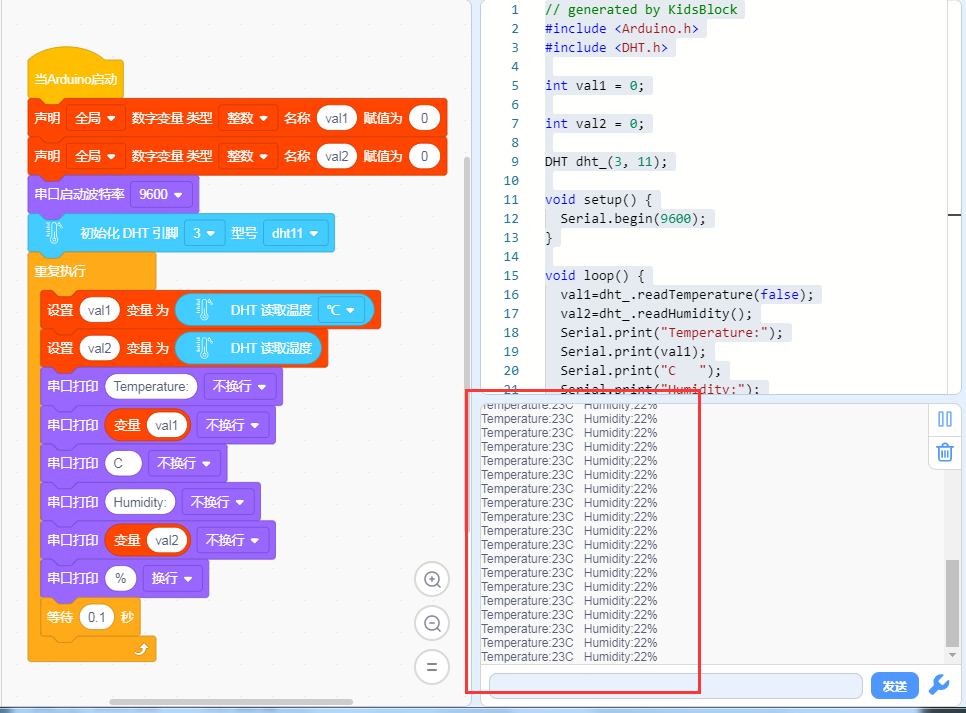

# KidsBlock

## 1. KidsBlock简介  

KidsBlock是一款面向儿童和初学者的图形化编程工具，旨在通过直观的界面和模块化编程方式，帮助用户轻松学习编程和电子技术。它支持与Arduino等硬件平台的连接，使得用户可以构建交互式项目，比如传感器应用、机器人控制等。KidsBlock提供多种功能模块，让学习过程富有趣味性和创造性，适合教育者和希望快速掌握编程基本概念的年轻学习者使用。  

## 2. 连接图  

  

## 3. 测试代码  

首先添加扩展DHT11模块  

。  

我们定义两个变量分别用于存放温度值和湿度值，把管脚设置为3，选择获取温度和获取湿度  

。  

串口监视器显示val1和val2的值，显示时，我们在数据后面添加单位。如果温度单位直接设置为℃，测试结果会出现乱码，所以我们直接用C代替℃；湿度单位直接设置为%  

。  

。  

## 4. 测试结果  

按照上图接好线，烧录好代码，上电后，您可以在软件串口监视器中看到当前环境温度值和湿度值，如下图所示。  

