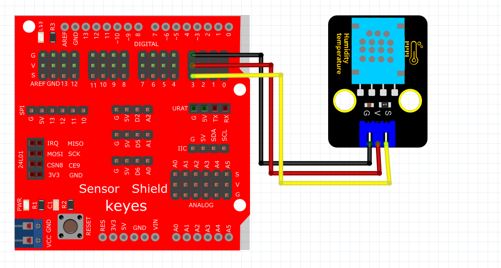

# Mixly

## 1. Mixly简介  

Mixly是一款面向初学者和儿童的图形化编程工具，旨在使编程学习更加有趣和直观。它采用拖放式的模块化编程方式，用户可以通过简单的积木来构建程序，而不需要深入理解编程语法。Mixly支持与Arduino等硬件平台的连接，使得用户能够轻松创建和实现各种电子项目，如机器人、传感器应用和物联网等。该工具提供了丰富的功能模块和直观的用户界面，适合教育场景中的编程教学。  

## 2. 连接图  

  

## 3. 测试代码  

1. 在变量栏拖出两个设置变量模块，并分别命名为val1，val2，然后赋值为0。  
   
     

2. 在控制栏拖出初始化模块，然后在串口栏拖出设置串口波特率模块并设置波特率为9600。  
   
     

3. 在变量栏拖出val1和val2的赋值模块，然后再传感器栏下的其他传感器栏下找到DXT11温度传感器模块并设置管脚为3，val1获取温度，val2获取湿度。  
   
     

4. 在串口栏拖出打印模块，然后在文本栏拖出文本模块并设置文本为“temperature:”。  
   
     

5. 在串口栏拖出打印模块然后在变量栏拖出变量val1模块。  
   
     

6. 在串口栏拖出打印模块然后在文本栏拖出文本模块并设置文本为“C”。  
   
     

7. 在串口栏拖出打印模块然后在文本栏拖出文本模块并设置文本为“humidity:”。  
   
     

8. 在串口栏拖出打印模块然后在变量栏拖出变量val2模块。  
   
     

9. 在串口栏拖出打印（自动换行）模块然后在文本栏拖出文本模块并设置文本为“%”。  
   
     

10. 在控制栏拖出延时模块并设置延时为100ms。  
    
      

## 4. 测试结果  

按照上图接好线，烧录好代码，上电后，您可以在软件串口监视器中看到当前环境温度值和湿度值，如下图所示。  

