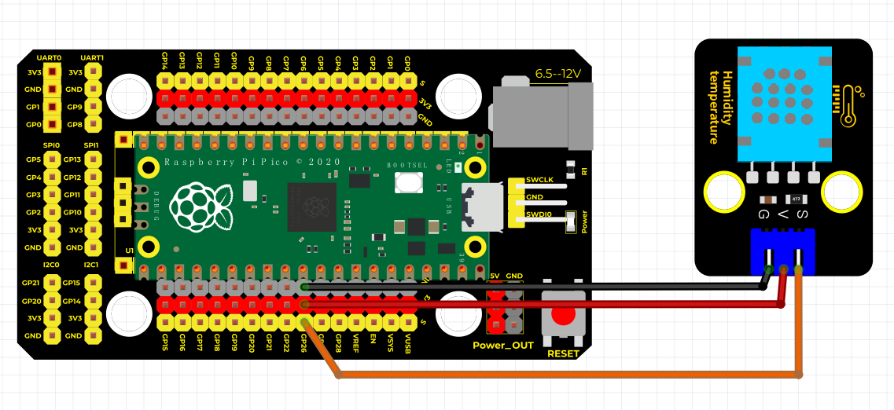
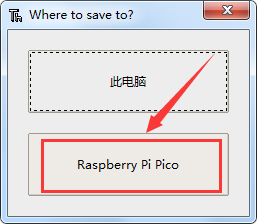
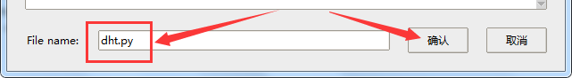
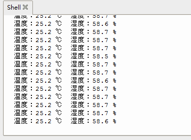

# Python


## 1. Python简介  

Python是一种高级、通用的编程语言，以其简洁的语法、强大的功能和丰富的库而广受欢迎。它支持多种编程范式，包括面向对象、命令式和函数式编程，非常适合用于开发网页应用、数据分析、人工智能、自动化脚本等。不仅如此，Python也广泛应用于教育领域，成为初学者学习编程的首选语言。由于其庞大的社区支持和丰富的第三方库，Python用户可以轻松找到解决问题的资源和工具，使得编程变得更为便捷和高效。  

## 2. 连接图  

  

## 3. 导入库  

我们将文件下的dht.py使用Thonny软件打开，选择对应的COM口后，我们点击文件栏然后选择Raspberry Pi Pico，然后设置文件名为dht.py点击确定！  

  
  
  

然后再打开文件里的DHT11.py文件，点击运行即可！  

  

## 4. 测试代码  

```python  
import machine  
import utime  
import dht  

pin = machine.Pin(26, machine.Pin.OUT, machine.Pin.PULL_DOWN)  
sensor = dht.DHT11(pin)  

while True:  
    print("温度：{} ℃ 湿度：{} %".format(sensor.temperature, sensor.humidity))  
    utime.sleep(1)  
```  

## 5. 测试结果  

按照上图接好线，烧录好代码，上电后，您可以在软件串口监视器中看到当前环境温度值和湿度值，如下图所示。  




